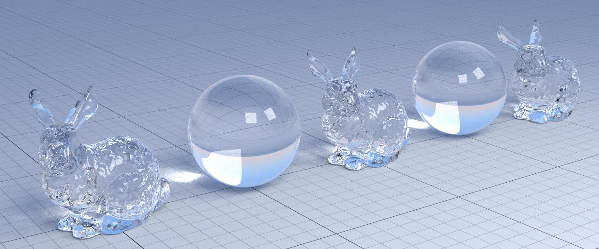
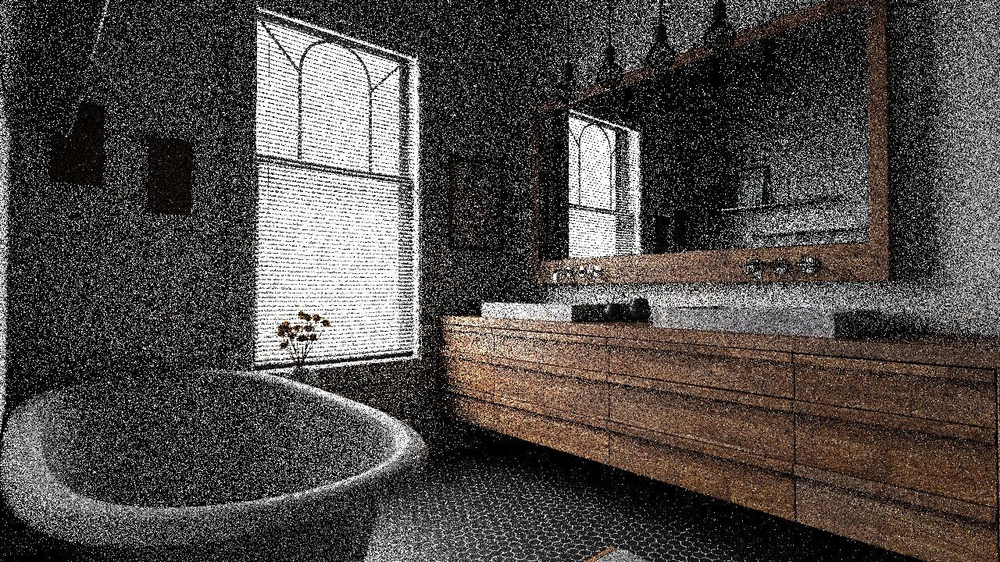
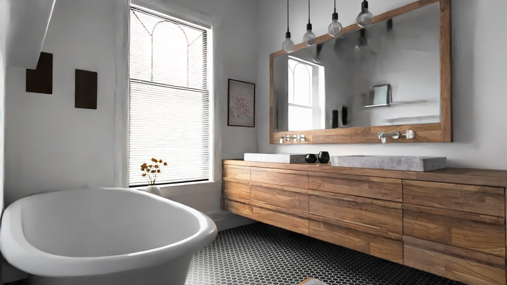
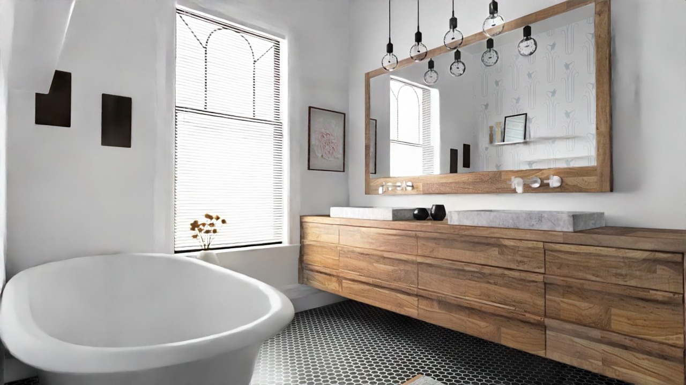
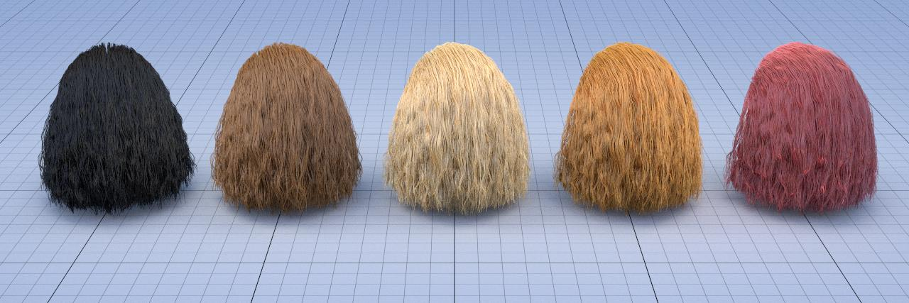

# HW 2 Fundamentals of Computer Graphics 21/22

## Refraction

I implemented it by adding a new case in the switches of various functions for this new type of material, as suggested by the professor. Then I added the functions offered by yocto for refraction.

## Bilinear Patches

In this case I followed the code from [Cool Patches](https://link.springer.com/chapter/10.1007/978-1-4842-4427-2_8) for the intersection of the bilinear patch and then modified eval_normal and eval_position to account for this change. For the normals we can use the precalculated normals for each vertex and interpolate between them. We do the same for the positions but we interpolate using the vertices. For these interpolations we use the uv coordinates obtained from the patch intersection. These changes were made in the yocto_bvh, yocto_geometry and yocto_scene files.

## Denoising

As suggested by the professor I created a separate executable by compiling the code, and including OpenImageIO for handling jpeg and png files. The executable takes as input the image, the albedos and the normals and outputs the denoised image. At first I only used the color from material.color to generate the albedos, but following the [oidn documentation](https://www.openimagedenoise.org/documentation.html) I also tried to generate better ones by using the color behind the object, when handling transparent materials, and calculating the reflected color for delta reflective materials. This second approach gives better results, but we need more time to generate the inputs for the denoising.

### Noisy

### Simple albedo

### Better albedo

## Hair Shading

For the hair rendering I followed pbrt's [implementation](https://www.pbrt.org/hair.pdf). I created separate files that contain almost all of the code for the hair material and integrated them in yocto by setting up the cmake files, all the files are in libs/yocto_extra. I also modified some code in yocto_scene and yocto_sceneio to better integrate the hair material and to read from the scene file the material properties.
For the BSDF calculations, since yocto uses world coordinates, I transform the normal, the outgoing and incoming directions to the coordinate system used by pbrt, which uses a frame that has as z direction the normal's direction and as y the tangent's direction. I also multiply for the cosine in the eval_hair_scattering function, following the yocto design.
The rendering test scene was created using a hair model found in [this repository](https://github.com/dsforza96/yocto-hair).

